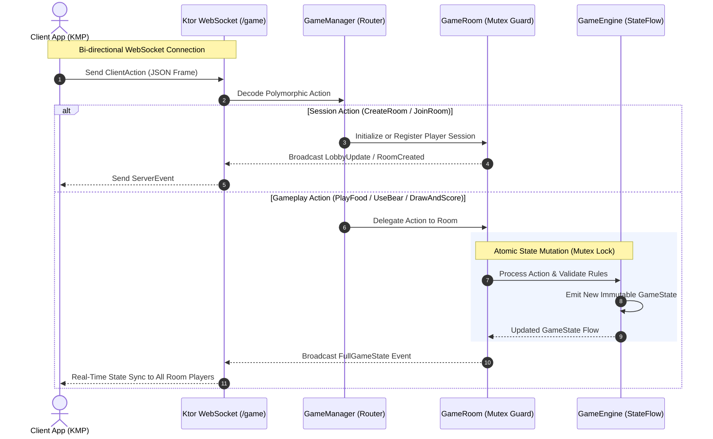

<div align="center">

# 🦝 RaccoonServer

**High-Performance Real-Time Multiplayer Card Game Server built with Kotlin, Ktor & WebSockets.**

[](https://kotlinlang.org)
[](https://ktor.io)
[](https://netty.io)
[](https://www.docker.com/)
[](https://www.gnu.org/licenses/agpl-3.0)

<p align="center">
  <a href="#-architectural-highlights">Architecture</a> •
  <a href="#-system-flow-diagram">System Flow</a> •
  <a href="#-websocket-protocol-specification">Protocol API</a> •
  <a href="#-getting-started">Quickstart</a> •
  <a href="#-testing--quality">Testing</a> •
  <a href="#-companion-client">Companion Client</a>
</p>

</div>

---

## 📖 Overview

**RaccoonServer** is a real-time, event-driven multiplayer game server that coordinates game rooms, player sessions, and game mechanics for the *Raccoon* card game. 

Engineered with modern Kotlin concurrency patterns, it decouples networking from game rules to deliver low-latency bidirectional communication via WebSockets, thread-safe room state transitions, and deterministic game state synchronization.

---

## ⚡ Architectural Highlights

* **Decoupled Reactive Game Engine (`GameEngine`):**
  Pure Kotlin domain layer managing rules, cards, turns, and scores. Completely agnostic of network frameworks and UI. State updates are broadcast reactively using Kotlin Coroutines `StateFlow` and immutable data classes (`GameState`).

* **Thread-Safe Room Isolation (`GameRoom` & `GameManager`):**
  Orchestrates concurrent rooms across an in-memory `ConcurrentHashMap`. Each room protects its mutations through coroutine-native mutual exclusion primitives (`kotlinx.coroutines.sync.Mutex`), preventing race conditions during simultaneous player actions.

* **Polymorphic Serialization (`kotlinx.serialization`):**
  Strongly typed bidirectional communication. Sealed hierarchies (`ClientAction` and `ServerEvent`) are serialized and deserialized polymorphically using a unified JSON discriminator (`type`), eliminating untyped messaging.

* **Production-Ready & Containerized:**
  Equipped with multi-stage `Dockerfile`, `docker-compose.yml`, and GitHub Actions CI for continuous verification.

---

## 📐 System Flow Diagram



---

## 📂 Project Structure

```text
src/
├── main/
│   ├── kotlin/com/shmbles/raccoon/
│   │   ├── Application.kt          # Netty EngineMain entrypoint & module loader
│   │   ├── Routing.kt              # WebSocket routing & lifecycle handler
│   │   ├── Serialization.kt        # Content negotiation & JSON configuration
│   │   ├── engine/
│   │   │   └── GameEngine.kt       # Pure domain game rules & StateFlow emission
│   │   ├── model/
│   │   │   └── GameModels.kt       # Immutable domain models (Player, Card, GameState)
│   │   ├── network/
│   │   │   └── ApiModels.kt        # Polymorphic ClientAction & ServerEvent contracts
│   │   └── server/
│   │       ├── GameManager.kt      # Global room registry & action dispatcher
│   │       ├── GameRoom.kt         # Room session manager & Mutex synchronization
│   │       └── helpers/
│   │           └── RoomCodeGenerator.kt # Secure random room code generator
│   └── resources/
│       ├── application.yaml        # Ktor server configuration & port bindings
│       └── logback.xml             # Structured logging configuration
└── test/
    └── kotlin/com/shmbles/raccoon/
        ├── engine/
        │   └── GameEngineTest.kt   # Exhaustive unit tests for game rules & phases
        ├── network/
        │   └── SerializationTest.kt# Contract tests for polymorphic JSON encoding
        └── server/helpers/
            └── RoomCodeGeneratorTest.kt # Entropy & format validation tests
```

---

## 📡 WebSocket Protocol Specification

All communication occurs through the `/game` WebSocket endpoint. Frames are exchanged as JSON strings adhering to polymorphic schemas.

### 📤 Client Actions (Sent to Server)

```json
// Create Room
{
  "type": "com.shmbles.raccoon.network.ClientAction.CreateRoom",
  "config": { "playerCount": 2, "winScore": 21 },
  "nickname": "Alex"
}

// Join Room
{
  "type": "com.shmbles.raccoon.network.ClientAction.JoinRoom",
  "roomCode": "ABCDE",
  "nickname": "Sam"
}

// Play Food Cards
{
  "type": "com.shmbles.raccoon.network.ClientAction.PlayFood",
  "color": "YELLOW"
}

// Use Bear Card
{
  "type": "com.shmbles.raccoon.network.ClientAction.UseBear",
  "bearCardId": 12,
  "targetPlayerId": "player-uuid",
  "targetColor": "BLUE"
}

// Draw and Score (End Turn)
{
  "type": "com.shmbles.raccoon.network.ClientAction.DrawAndScore"
}
```

### 📥 Server Events (Received from Server)

```json
// Room Created Confirmation
{
  "type": "com.shmbles.raccoon.network.ServerEvent.RoomCreated",
  "roomCode": "ABCDE"
}

// Lobby State Synchronization
{
  "type": "com.shmbles.raccoon.network.ServerEvent.LobbyUpdate",
  "playerNicknames": ["Alex", "Sam"],
  "config": { "playerCount": 2, "winScore": 21 }
}

// Error Message
{
  "type": "com.shmbles.raccoon.network.ServerEvent.ErrorMessage",
  "message": "Room ABCDE is already full"
}
```

---

## 🚀 Getting Started

### Prerequisites
* **JDK 21+**
* (Optional) **Docker** and **Docker Compose**

### Running with Gradle (Local Development)

1. Clone the repository:
   ```bash
   git clone https://github.com/Shmbles/RaccoonServer.git
   cd RaccoonServer
   ```

2. Start the development server:
   ```bash
   ./gradlew run
   ```
   The server will start listening on `http://0.0.0.0:8080`.

### Running with Docker

Run the containerized server in one command:
```bash
docker compose up -d --build
```

To view logs:
```bash
docker compose logs -f
```

---

## 🧪 Testing & Quality

Run the test suite:
```bash
./gradlew test
```

Generate the fat JAR for deployment:
```bash
./gradlew buildFatJar
```

---

## 📱 Companion Client

This server powers the **[RaccoonKMP](https://github.com/Shmbles/RaccoonKMP)** client application, built with **Kotlin Multiplatform (KMP)** and **Compose Multiplatform (CMP)** targeting Android, iOS, and Desktop.

---

## 📄 License

This project is licensed under the **GNU Affero General Public License v3 (AGPL-3.0)**. See the [LICENSE](LICENSE) file for details.

---

<div align="center">
  <sub>Developed with ❤️ by <a href="https://github.com/Shmbles">Andrés Díaz</a>.</sub>
</div>
